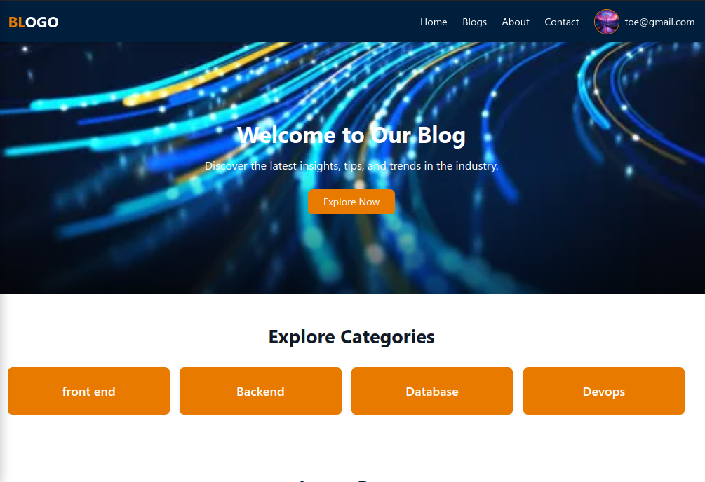
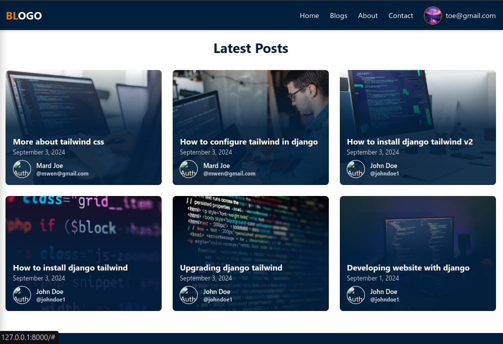
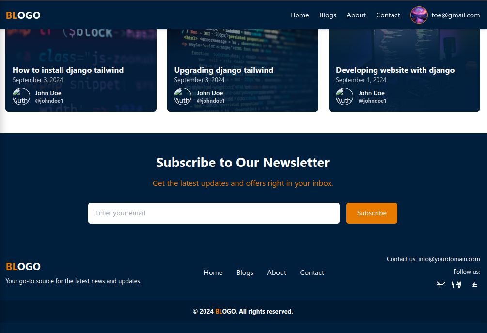
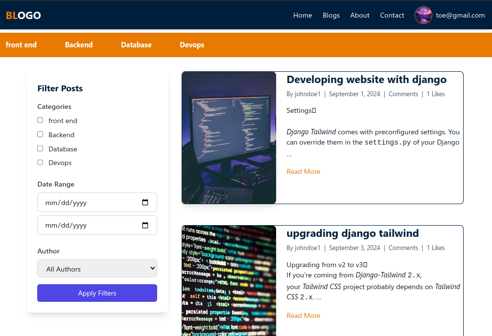
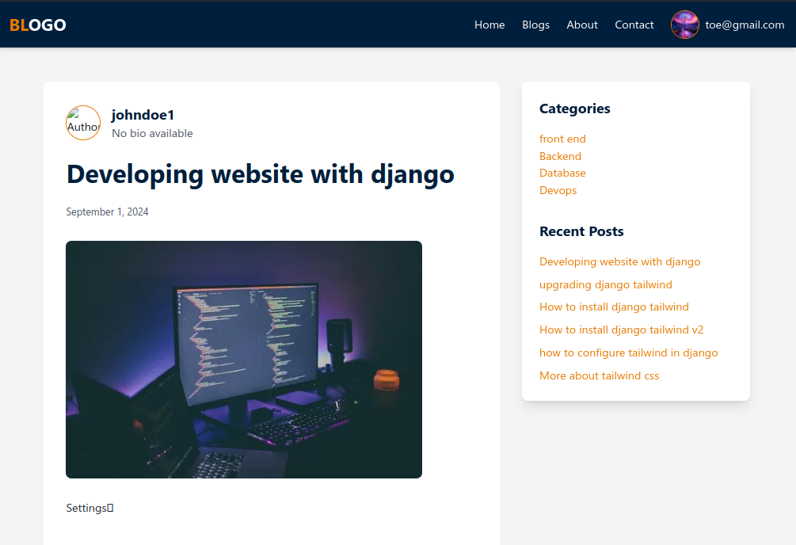
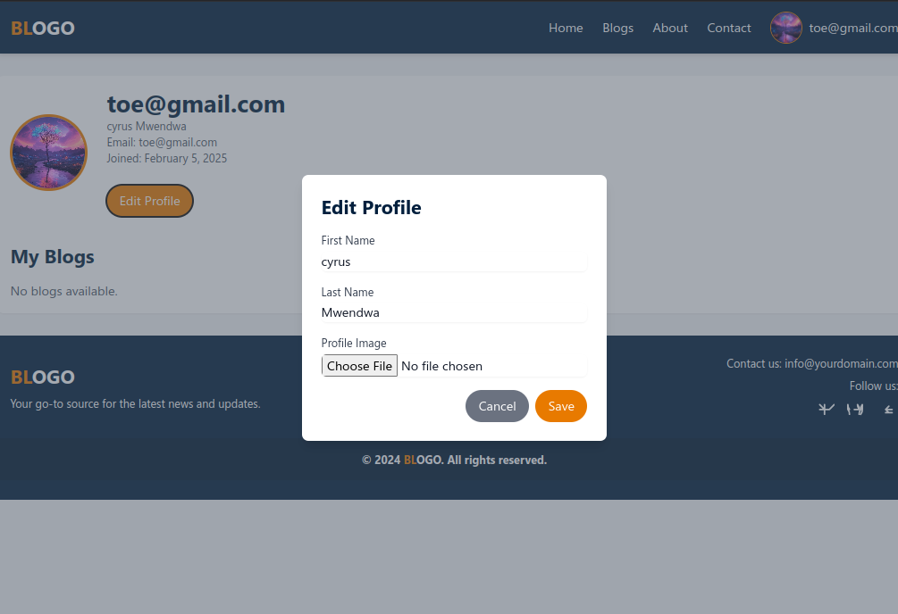

# BLOGO - Modern Blog Platform

BLOGO is a  blog platform built with Django and styled with Tailwind CSS. It provides a modern, responsive interface for creating, sharing, and engaging with blog posts.

## Features

### 🏠 Home Page
- Featured blog posts display
- Category filtering
- Responsive navigation
- Search functionality

### 📝 Blog Posts
- Rich text editing with CKEditor
- Image uploads
- Category tagging
- Comments and nested replies
- Like/Unlike functionality
- Share options

### 👤 User Features
- User registration and authentication
- Profile customization
- Profile pictures
- Personal blog management
- Comment management

### 💅 Design
- Modern UI with Tailwind CSS
- Responsive design
- Dark/Light mode support
- Smooth transitions and animations

## Screenshots

### Home Page Views




### Blog Features



### Social Engagement


### User Profile


## Setup Instructions

1. Clone the repository
```bash 
clone
cd  to-repo
```

2. Create and activate virtual environment
```bash
python -m venv venv
source venv/bin/activate  # Linux/Mac
# or
.\venv\Scripts\activate  # Windows
```

3. Install dependencies
```bash
pip install -r requirements.txt
```

4. Set up Tailwind CSS
- Download the standalone Tailwind CLI
- Initialize tailwind.config.js
- Start the Tailwind build process:
```bash
./tailwindcss -i static/css/src/input.css -o static/css/dist/styles.css --watch
```

5. Run migrations
```bash
python manage.py migrate
```

6. Create superuser
```bash
python manage.py createsuperuser
```

7. Run the development server
```bash
python manage.py runserver
```

## Project Structure

```
blog-master/
├── blog/                   # Project configuration
├── blogapp/               # Main application
│   ├── templates/        # HTML templates
│   ├── static/          # Static files
│   ├── models.py        # Database models
│   └── views.py         # View logic
├── static/              # Global static files
│   └── css/            # CSS files
└── manage.py           # Django management script
```

## Key Technologies

- **Backend**: Django 5.1
- **Frontend**: Tailwind CSS 3.4
- **Database**: SQLite (default)
- **Editor**: CKEditor
- **Image Processing**: Pillow
- **Authentication**: Django built-in auth

 

## Contributing

1. Fork the repository
2. Create your feature branch
3. Commit your changes
4. Push to the branch
5. Create a Pull Request

## License

This project is licensed under the MIT License - see the LICENSE file for details.